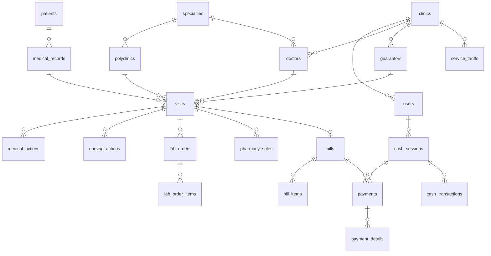

# Klinik Amanah API

REST API modul **keuangan** Klinik Amanah: tagihan kunjungan, pembayaran, sesi kasir, dan transaksi kas.
API ini memakai database yang sama dengan aplikasi Laravel klinik-amanah. Nama tabel, nama kolom,
hak akses (Spatie Permission), dan token API (Laravel Sanctum) dibuat kompatibel, sehingga kedua aplikasi
bisa memakai user dan token yang sama.

## Teknologi

| Komponen | Teknologi |
| --- | --- |
| Bahasa | Java 21 |
| Framework | Spring Boot 4.1.1 (Spring Web MVC) |
| Akses data | Spring Data JPA (Hibernate) dan `JdbcTemplate` |
| Database | MySQL (driver `mysql-connector-j`) |
| Migrasi skema | Flyway (`flyway-mysql`) |
| Hash password | BCrypt dari `spring-security-crypto` (kompatibel dengan hash `$2y$` Laravel) |
| Autentikasi | Bearer token gaya Laravel Sanctum, disimpan di tabel `personal_access_tokens` |
| Boilerplate | Lombok |
| Build tool | Maven (melalui Maven Wrapper `mvnw`) |
| Testing | Spring Boot Starter Test (JUnit 5) |

## Menjalankan Aplikasi

1. Jalankan MySQL di `localhost:3306` dengan user `root` tanpa password, atau sesuaikan pengaturannya di
   [application.properties](src/main/resources/application.properties).
   Database `klinikamanah_db` dibuat otomatis jika belum ada.
2. Jalankan aplikasi:

   ```bash
   ./mvnw spring-boot:run        # Linux/macOS
   mvnw.cmd spring-boot:run      # Windows
   ```

3. Saat aplikasi start, Flyway membuat semua tabel dan mengisi data contoh.
   API berjalan di port `8000` pada alamat yang diatur di `server.address`.

Pengaturan penting di `application.properties`:

| Properti | Keterangan |
| --- | --- |
| `server.port` | Port HTTP (`8000`). |
| `server.address` | IP tempat server listen, tanpa `http://`. Hapus baris ini atau isi `0.0.0.0` untuk listen di semua interface. |
| `spring.flyway.locations` | `db/migration` berisi skema; `db/demo` berisi data contoh. **Hapus `db/demo` di produksi.** |
| `app.timezone` | Zona waktu untuk menentukan "hari ini" (tanggal tagihan, nomor dokumen, filter tanggal). Default `UTC`. |

### Akun dan Data Demo

Data demo ada di `db/demo`: `V100__demo_data.sql` dan `V101__demo_data_keuangan.sql`. Data ini membuat
dua user dengan role `keuangan` di Klinik Hasanah. Password keduanya: `password`.

| Email | Keterangan |
| --- | --- |
| `kasir@klinik.id` | Kasir utama. Sudah punya sesi kasir yang **berjalan hari ini**, jadi bisa langsung menerima pembayaran |
| `kasir2@klinik.id` | Kasir kedua. Tidak punya sesi berjalan, untuk mencoba membuka sesi kasir dan menguji kepemilikan sesi |

Isi data demo:

- **Master:** 12 pasien, 3 dokter (umum dan gigi), Poli Umum dan Poli Gigi, 2 penjamin (Asuransi Sehat dan
  PT Maju Bersama), serta 14 tarif layanan aktif.
- **Kunjungan hari ini**, ditampilkan di daftar tagihan:

  | Kunjungan | Pasien | Kondisi tagihan |
  | --- | --- | --- |
  | 1 | Siti Aminah | Belum ditagih, tanpa biaya otomatis |
  | 2 | Budi Santoso | Belum ditagih, penjamin; sudah ada tindakan medis dan keperawatan |
  | 3 | Ahmad Fauzi | Draft Rp130.000, siap dibayar |
  | 4 | Dewi Lestari | Lunas tunai |
  | 5 | Rudi Hartono | Lunas QRIS + tunai |
  | 6 | Nur Halimah | Piutang PT Maju Bersama |
  | 7 | Agus Setiawan | Belum ditagih; sudah ada tindakan tambal gigi dan obat |
  | 8 | Rina Marlina | Draft Rp250.000 dengan pembayaran yang dibatalkan |

- **Riwayat kemarin (H-1) dan dua hari lalu (H-2):** tagihan lunas dengan berbagai metode pembayaran
  (tunai, kartu debit, transfer), piutang penjamin yang lunas dan yang baru dibayar sebagian, satu tagihan
  dengan diskon, sesi kasir yang sudah ditutup (termasuk satu dengan selisih kas), serta transaksi kas masuk
  dan keluar (termasuk satu yang dibatalkan).

Tanggal data demo dihitung dari waktu migrasi dijalankan (UTC). Daftar tagihan secara default menampilkan
kunjungan hari ini. Untuk melihat data demo di hari lain, pakai parameter `?date=YYYY-MM-DD`. Untuk
memperbarui data demo ke tanggal hari ini, hapus database `klinikamanah_db` lalu jalankan aplikasi lagi.

## Struktur Project

```
klinikamanah-api/
├── pom.xml                                  Dependensi dan konfigurasi build Maven
├── mvnw, mvnw.cmd                           Maven Wrapper
└── src/
    ├── main/
    │   ├── java/com/teguh/klinikamanah/klinikamanah_api/
    │   │   ├── KlinikamanahApiApplication.java   Entry point Spring Boot
    │   │   ├── auth/                        Login, logout, token, dan pengecekan hak akses
    │   │   │   ├── AuthController.java      POST /api/login, GET /api/me, POST /api/logout
    │   │   │   ├── AuthService.java         Verifikasi password BCrypt dan token gaya Sanctum
    │   │   │   ├── AuthInterceptor.java     Mewajibkan header "Authorization: Bearer {token}" di /api/**
    │   │   │   ├── AuthUser.java            User yang sedang login beserta permission-nya
    │   │   │   └── WebConfig.java           Registrasi interceptor
    │   │   ├── common/                      Utilitas bersama
    │   │   │   ├── ApiException.java        Error HTTP (401, 403, 404, ...)
    │   │   │   ├── ValidationException.java Error validasi per field (422)
    │   │   │   ├── GlobalExceptionHandler.java  Mengubah exception menjadi respons JSON
    │   │   │   ├── AppTime.java             Waktu dan tanggal "hari ini" sesuai app.timezone
    │   │   │   ├── DocumentNumbers.java     Pembuatan nomor dokumen (tagihan, pembayaran, kas)
    │   │   │   ├── Formats.java, Input.java, Pagination.java
    │   │   ├── domain/                      Entity JPA dan daftar nilai enum
    │   │   │   ├── BaseEntity.java          Kolom id, created_at, updated_at
    │   │   │   ├── Clinic, User, Doctor, Patient, MedicalRecord, Polyclinic, Guarantor, Visit
    │   │   │   ├── ServiceTariff, VisitCharges
    │   │   │   ├── Bill, BillItem, Payment, PaymentDetail, CashSession, CashTransaction
    │   │   │   └── Labels.java              Nilai status/kategori beserta label Bahasa Indonesia
    │   │   ├── finance/                     Modul keuangan
    │   │   │   ├── BillController / BillService                 Tagihan kunjungan
    │   │   │   ├── PaymentController / PaymentService           Pembayaran tagihan
    │   │   │   ├── CashSessionController / CashSessionService   Sesi kasir (buka/tutup kas)
    │   │   │   ├── CashTransactionController / CashTransactionService  Kas masuk/keluar
    │   │   │   ├── FinancePolicy.java       Aturan otorisasi berbasis permission dan klinik
    │   │   │   ├── FinanceJson.java         Bentuk respons JSON
    │   │   │   └── Records.java             DTO request
    │   │   └── repository/                  Spring Data JPA repository
    │   └── resources/
    │       ├── application.properties
    │       └── db/
    │           ├── migration/               Skema database (Flyway)
    │           │   ├── V1__create_core_tables.sql
    │           │   ├── V2__create_finance_tables.sql
    │           │   └── V3__seed_finance_permissions.sql
    │           └── demo/
    │               └── V100__demo_data.sql  Data contoh (khusus pengembangan)
    └── test/                                Unit/integration test
```

## Endpoint API

Semua endpoint kecuali `POST /api/login` wajib memakai header `Authorization: Bearer {token}`.

| Method | Path | Keterangan |
| --- | --- | --- |
| POST | `/api/login` | Login dengan `email`, `password`, dan `device_name` (opsional). Menghasilkan `access_token` |
| GET | `/api/me` | Data user yang sedang login |
| POST | `/api/logout` | Menghapus token saat ini |
| GET | `/api/bills/references` | Data referensi untuk form tagihan |
| GET | `/api/bills` | Daftar tagihan |
| PUT | `/api/visits/{visitId}/bill` | Buat atau ubah tagihan sebuah kunjungan |
| GET | `/api/bills/{billId}` | Detail tagihan |
| PATCH | `/api/bills/{billId}/finalize` | Finalisasi tagihan |
| PATCH | `/api/bills/{billId}/reopen` | Buka kembali tagihan |
| POST | `/api/bills/{billId}/payments` | Bayar tagihan |
| GET | `/api/payments/{paymentId}` | Detail pembayaran |
| PATCH | `/api/payments/{paymentId}/cancel` | Batalkan pembayaran |
| GET | `/api/cash-sessions` | Daftar sesi kasir |
| GET | `/api/cash-sessions/current` | Sesi kasir yang sedang berjalan milik user |
| POST | `/api/cash-sessions` | Buka sesi kasir |
| GET | `/api/cash-sessions/{sessionId}` | Detail sesi kasir |
| PATCH | `/api/cash-sessions/{sessionId}/close` | Tutup sesi kasir |
| GET | `/api/cash-transactions/references` | Data referensi kategori dan metode kas |
| GET | `/api/cash-transactions` | Daftar transaksi kas |
| POST | `/api/cash-transactions` | Catat kas masuk/keluar |
| GET | `/api/cash-transactions/{transactionId}` | Detail transaksi kas |
| PATCH | `/api/cash-transactions/{transactionId}/cancel` | Batalkan transaksi kas |

## Struktur Database

Semua tabel memakai InnoDB, charset `utf8mb4_unicode_ci`, primary key `id BIGINT UNSIGNED AUTO_INCREMENT`,
serta kolom `created_at` dan `updated_at` (kecuali tabel pivot). Kolom `TIMESTAMP` disimpan dalam UTC.
Hampir semua data bersifat multi-klinik melalui kolom `clinic_id`.

### Relasi Antar Tabel



### Tabel Inti (`V1__create_core_tables.sql`)

**clinics**: data klinik (tenant)

| Kolom | Tipe | Keterangan |
| --- | --- | --- |
| name | VARCHAR(255) | Nama klinik |
| email, phone, city, address | | Kontak dan alamat |
| plan | VARCHAR(20) | Paket langganan |
| is_active | TINYINT(1) | Klinik aktif. Jika nonaktif, user-nya tidak bisa login |
| trial_ends_at | TIMESTAMP | Akhir masa trial |

**users**: pengguna aplikasi

| Kolom | Tipe | Keterangan |
| --- | --- | --- |
| clinic_id | FK → clinics | Klinik tempat user bekerja |
| name, email (unique), phone | | Identitas user |
| password | VARCHAR(255) | Hash BCrypt |
| is_active | TINYINT(1) | Status akun |
| last_login_at, email_verified_at, remember_token | | Kompatibilitas Laravel |

**Hak akses (Spatie Permission)**

| Tabel | Kolom | Keterangan |
| --- | --- | --- |
| permissions | name, guard_name | Daftar permission, contoh `bills.view` |
| roles | name, guard_name | Daftar role, contoh `super-admin` dan `keuangan` |
| model_has_roles | role_id, model_type, model_id | Role milik user (`model_type = App\Models\User`) |
| model_has_permissions | permission_id, model_type, model_id | Permission langsung milik user |
| role_has_permissions | permission_id, role_id | Permission milik role |

**personal_access_tokens**: token API (Laravel Sanctum)

| Kolom | Tipe | Keterangan |
| --- | --- | --- |
| tokenable_type, tokenable_id | | Pemilik token (user) |
| name | TEXT | Nama perangkat |
| token | VARCHAR(64), unique | Hash SHA-256 dari token. Klien menerima format `{id}\|{token}` |
| abilities | TEXT | Kemampuan token, contoh `["*"]` |
| last_used_at, expires_at | TIMESTAMP | Pemakaian terakhir dan kedaluwarsa |

**Master dan kunjungan pasien**

| Tabel | Kolom Utama | Keterangan |
| --- | --- | --- |
| specialties | code (unique), name (unique), title, is_active | Spesialisasi dokter |
| polyclinics | specialty_id, code (unique), name (unique), is_active | Poliklinik |
| doctors | clinic_id, specialty_id, user_id (unique), name, gender, license_number, is_active | Dokter. `license_number` unik per klinik |
| patients | nik (unique), name, birth_place, birth_date, gender, phone, address, religion, education, occupation, marital_status, nationality, guardian_* | Data pasien (lintas klinik) |
| medical_records | clinic_id, patient_id, sequence, number | Nomor rekam medis pasien per klinik |
| guarantors | clinic_id, code, name, type, contact_person, cooperation_starts_at, cooperation_ends_at, is_active | Penjamin (asuransi/perusahaan) |
| visits | clinic_id, medical_record_id, doctor_id, polyclinic_id, payment_type, guarantor_id, guarantor_member_number, referral_*, visit_date, queue_number, complaint, status | Kunjungan pasien. Unik per (doctor_id, visit_date, queue_number) |

### Tabel Keuangan (`V2__create_finance_tables.sql`)

**service_tariffs**: tarif layanan

| Kolom | Tipe | Keterangan |
| --- | --- | --- |
| clinic_id | FK → clinics | |
| code | VARCHAR(20) | Unik per klinik |
| name | VARCHAR(255) | Nama layanan |
| category | VARCHAR(30) | `administration`, `consultation`, `procedure`, `nursing`, `laboratory`, `radiology`, `physiotherapy`, `other` |
| price | DECIMAL(15,2) | Harga |
| is_active | TINYINT(1) | Tarif aktif |

**Sumber biaya kunjungan.** Tabel-tabel ini diisi oleh modul klinis aplikasi lain dan otomatis
masuk ke tagihan. Di sini hanya disimpan kolom yang dibaca modul keuangan.

| Tabel | Kolom Utama | Keterangan |
| --- | --- | --- |
| medical_actions | clinic_id, visit_id, service_tariff_id, user_id, performed_at, description, quantity, unit_price, subtotal | Tindakan medis |
| nursing_actions | (sama dengan medical_actions) | Tindakan keperawatan |
| lab_orders | clinic_id, visit_id, number, priority, status, requested_at, completed_at, cancelled_at, total_price | Order laboratorium |
| lab_order_items | lab_order_id, service_tariff_id, test_name, section, unit_price, quantity, total_price, status | Item pemeriksaan lab |
| pharmacy_sales | clinic_id, visit_id, number, sale_date, status, items_total, compounding_fee, total, cancelled_* | Penjualan farmasi |

**bills**: tagihan, satu tagihan per kunjungan

| Kolom | Tipe | Keterangan |
| --- | --- | --- |
| clinic_id, visit_id (unique), guarantor_id, user_id | FK | |
| number | VARCHAR(30) | Nomor tagihan, unik per klinik |
| bill_date | DATE | Tanggal tagihan |
| payer_type | VARCHAR(20) | `self` (tanpa penjamin) / `guarantor` (penjamin) |
| status | VARCHAR(20) | `draft` (belum dibayar), `receivable` (piutang), `paid` (lunas) |
| services_total, medical_total, nursing_total, laboratory_total, pharmacy_total | DECIMAL(15,2) | Subtotal per sumber biaya |
| discount, total, paid_amount | DECIMAL(15,2) | Diskon, total tagihan, jumlah terbayar |
| notes | TEXT | Catatan |
| finalized_at | TIMESTAMP | Waktu finalisasi |

**bill_items**: rincian tagihan

| Kolom | Tipe | Keterangan |
| --- | --- | --- |
| bill_id | FK → bills | |
| service_tariff_id, pharmacy_sale_id, nursing_action_id, medical_action_id, lab_order_item_id | FK (nullable) | Asal item. Salah satu terisi sesuai sumbernya |
| description | VARCHAR(255) | Uraian |
| quantity, unit_price, subtotal | | Jumlah, harga satuan, subtotal |

**payments**: pembayaran tagihan

| Kolom | Tipe | Keterangan |
| --- | --- | --- |
| clinic_id, bill_id, cash_session_id, user_id | FK | Pembayaran terhubung ke sesi kasir yang sedang berjalan |
| number | VARCHAR(30) | Nomor pembayaran, unik per klinik |
| payer_type | VARCHAR(20) | `self` / `guarantor` |
| status | VARCHAR(20) | `completed` (berhasil) / `cancelled` (dibatalkan) |
| paid_at | TIMESTAMP | Waktu bayar |
| amount, tendered, change_amount | DECIMAL(15,2) | Jumlah bayar, uang diterima, kembalian |
| cancelled_at, cancelled_by, cancellation_reason | | Data pembatalan |

**payment_details**: rincian metode pembayaran (satu pembayaran bisa memakai beberapa metode)

| Kolom | Tipe | Keterangan |
| --- | --- | --- |
| payment_id | FK → payments | |
| method | VARCHAR(20) | `cash`, `credit_card`, `debit_card`, `qris`, `transfer` |
| amount | DECIMAL(15,2) | Nominal |
| reference | VARCHAR(100) | Nomor referensi transaksi non-tunai |

**cash_sessions**: sesi kasir (buka/tutup kas)

| Kolom | Tipe | Keterangan |
| --- | --- | --- |
| clinic_id, user_id | FK | Kasir pemilik sesi |
| number | VARCHAR(30) | Nomor sesi, unik per klinik |
| status | VARCHAR(20) | `open` (berjalan) / `closed` (ditutup) |
| opened_at, opening_balance, opening_notes | | Data pembukaan kas |
| closed_at, expected_cash, counted_cash, difference, closing_notes | | Data penutupan dan selisih kas |

**cash_transactions**: kas masuk/keluar di luar pembayaran tagihan

| Kolom | Tipe | Keterangan |
| --- | --- | --- |
| clinic_id, cash_session_id, user_id | FK | |
| number | VARCHAR(30) | Nomor transaksi (prefix `KM` kas masuk / `KK` kas keluar), unik per klinik |
| type | VARCHAR(10) | `in` / `out` |
| category | VARCHAR(30) | Masuk: `capital`, `rent`, `partnership`, `donation`, `interest`, `other`. Keluar: `operational`, `salary`, `utilities`, `supplies`, `maintenance`, `rent`, `tax`, `deposit`, `other` |
| method | VARCHAR(20) | `cash` / `transfer` |
| status | VARCHAR(20) | `completed` (tercatat) / `cancelled` (dibatalkan) |
| transaction_date | DATE | Tanggal transaksi |
| amount | DECIMAL(15,2) | Nominal |
| description, reference | | Uraian dan nomor referensi |
| cancelled_at, cancelled_by, cancellation_reason | | Data pembatalan |

### Permission Keuangan (`V3__seed_finance_permissions.sql`)

Migrasi ini membuat role `super-admin` dan `keuangan`. Role `keuangan` mendapat permission berikut:

`dashboard.view`, `guarantors.view`, `visits.view`, `service_tariffs.view|create|edit|delete`,
`bills.view`, `bills.create`, `bills.pay`, `payments.cancel`, `receivables.view`, `receivables.settle`,
`cash_sessions.view`, `cash_sessions.create`, `cash_transactions.view|create|cancel`, `finance_reports.view`.

Permission `clinics.view` juga dibuat, tetapi tidak diberikan ke role `keuangan`.
