# Klinik Amanah App

Aplikasi mobile (Android) untuk staf **Sistem Klinik Amanah**: pendaftaran kunjungan pasien, antrean, jadwal dokter, tagihan & pembayaran, serta kas kasir. Aplikasi ini adalah klien dari REST API Spring Boot `klinik-amanah` dan memakai logika bisnis yang sama dengan versi web.

## Daftar Isi

- [Fitur](#fitur)
- [Teknologi](#teknologi)
- [Struktur Project](#struktur-project)
- [Menjalankan Project](#menjalankan-project)
- [Build Android](#build-android)
- [Integrasi API](#integrasi-api)
- [Screenshot](#screenshot)

## Fitur

| Modul | Fitur |
|---|---|
| **Autentikasi** | Login dengan token Bearer, sesi tersimpan di perangkat, logout otomatis saat token kedaluwarsa (401) |
| **Beranda** | Ringkasan hari ini: pendapatan tagihan, jumlah kunjungan, kas masuk/keluar, dokter praktik beserta sisa kuota; menu cepat |
| **Pasien** | Pencarian pasien (nama, no. RM, tanggal lahir), riwayat kunjungan pasien |
| **Kunjungan** | Registrasi kunjungan hari ini (jadwal dokter, penjamin, rujukan, keluhan), nomor antrean, detail & pembatalan |
| **Antrian** | Daftar kunjungan per tanggal dengan filter nama/RM dan status |
| **Jadwal** | Dokter yang praktik hari ini, status praktik, dan sisa kuota |
| **Dokter** | Daftar dokter, filter hari & spesialisasi, detail dokter dengan jadwal mingguan |
| **Penjamin** | Daftar penjamin yang aktif bekerja sama dengan klinik |
| **Pembayaran** | Daftar tagihan per tanggal, buat/ubah tagihan, piutang penjamin, pembayaran split, struk & pembatalan pembayaran |
| **Kasir** | Buka/tutup sesi kasir (dengan perhitungan selisih), riwayat sesi, kas masuk/keluar |

Tombol dan menu menyesuaikan izin (permission) user dari server; bagian yang tidak bisa diakses disembunyikan.

## Teknologi

| Kategori | Teknologi |
|---|---|
| Framework | [Angular 21](https://angular.dev) (standalone components, signals, control flow `@if`/`@for`) |
| UI mobile | [Ionic 8](https://ionicframework.com) (`@ionic/angular/standalone`): tabs, menu/drawer, refresher, infinite scroll, alert, toast |
| Komponen UI | [Angular Material 21](https://material.angular.dev) (form field, select, button toggle, checkbox) + Material Icons |
| Native | [Capacitor 8](https://capacitorjs.com) (Android), `CapacitorHttp` untuk request HTTP lewat native layer |
| Bahasa | TypeScript 5.9, SCSS |
| State & async | Angular Signals, RxJS 7 |
| Form | Reactive Forms |
| Testing | Vitest + jsdom |
| Backend | [Spring Boot](https://spring.io/projects/spring-boot) REST API dengan Spring Security (token Bearer), repo terpisah: `klinik-amanah` |

## Struktur Project

```
klinikamanah-app/
├── android/                  # Project native Android (Capacitor)
├── public/                   # Aset statis (favicon, dsb.)
├── screenshoot/              # Screenshot aplikasi untuk dokumentasi
├── src/
│   ├── app/
│   │   ├── core/             # Logika non-UI yang dipakai bersama
│   │   │   ├── guards/       # authGuard & guestGuard untuk rute
│   │   │   ├── interceptors/ # Menambahkan token Bearer, menangani 401
│   │   │   ├── menu/         # Definisi menu (dipakai beranda & drawer)
│   │   │   ├── models/       # Tipe data respons/request API
│   │   │   ├── services/     # Pemanggilan API per modul
│   │   │   └── utils/        # Helper, mis. pesan error HTTP
│   │   ├── pages/            # Halaman, dikelompokkan per modul
│   │   │   ├── splash/       # Layar pembuka
│   │   │   ├── login/        # Login
│   │   │   ├── main/         # Kerangka utama: drawer menu + bottom tabs
│   │   │   ├── home/         # Beranda & ringkasan hari ini
│   │   │   ├── patients/     # Pencarian pasien
│   │   │   ├── visits/       # Registrasi, antrean, detail & riwayat kunjungan
│   │   │   ├── schedules/    # Jadwal dokter hari ini
│   │   │   ├── doctors/      # Daftar & detail dokter
│   │   │   ├── guarantors/   # Daftar penjamin
│   │   │   ├── bills/        # Tagihan, pembayaran, struk
│   │   │   ├── cash/         # Sesi kasir & kas masuk/keluar
│   │   │   ├── profile/      # Profil & logout
│   │   │   └── placeholder/  # Halaman sementara untuk fitur yang belum ada
│   │   ├── app.component.ts  # Root component (ion-app)
│   │   ├── app.config.ts     # Provider: router, HttpClient, Ionic, animasi
│   │   └── app.routes.ts     # Definisi seluruh rute (lazy loaded)
│   ├── environments/
│   │   └── environment.ts    # URL API
│   ├── theme/variables.css   # Variabel warna Ionic
│   ├── index.html
│   ├── main.ts
│   └── styles.scss           # Gaya global
├── angular.json
├── capacitor.config.ts       # Konfigurasi Capacitor (appId, webDir, CapacitorHttp)
├── ionic.config.json
└── package.json
```

Setiap layanan di `core/services` membungkus satu kelompok endpoint:

| Service | Endpoint |
|---|---|
| `auth.service.ts` | `/login`, `/me`, `/logout` |
| `patient.service.ts` | `/patients/search` |
| `visit.service.ts` | `/visits/*`, `/medical-records/{id}/visits` |
| `doctor.service.ts` | `/doctors` |
| `bill.service.ts` | `/bills/*`, `/visits/{id}/bill`, `/payments/*` |
| `cash.service.ts` | `/cash-sessions/*`, `/cash-transactions/*` |
| `dashboard.service.ts` | Menggabungkan beberapa endpoint di atas untuk ringkasan beranda |

## Menjalankan Project

**Prasyarat:** Node.js 20+ dan npm, serta API Spring Boot `klinik-amanah` yang sedang berjalan.

1. Install dependency:

   ```bash
   npm install
   ```

2. Atur URL API di [src/environments/environment.ts](src/environments/environment.ts):

   ```ts
   export const environment = {
     apiUrl: 'http://192.168.1.7:8000/api',
   };
   ```

   Saat dijalankan di HP, gunakan IP komputer di jaringan yang sama (bukan `localhost`), pastikan server Spring Boot menerima koneksi dari jaringan (`server.address=0.0.0.0`), dan sesuaikan port pada `apiUrl` dengan `server.port` (default Spring Boot `8080`).

3. Jalankan di browser:

   ```bash
   npm start
   ```

   Buka `http://localhost:4200/`.

## Build Android

```bash
npm run build              # hasil ke dist/klinikamanah-app/browser
npx cap sync android       # salin hasil build ke project Android
npx cap open android       # buka di Android Studio, lalu Run / build APK
```

`CapacitorHttp` diaktifkan di [capacitor.config.ts](capacitor.config.ts) supaya request ke API `http://` tidak terkena CORS maupun blokir mixed-content di WebView.

## Integrasi API

- **Autentikasi:** token dari `POST /login` disimpan di `localStorage` dan dikirim sebagai `Authorization: Bearer <token>` oleh [auth.interceptor.ts](src/app/core/interceptors/auth.interceptor.ts). Respons `401` menghapus sesi dan mengarahkan ke halaman login.
- **Hak akses:** izin user (`permissions`, `roles`) dari `/me` dipakai untuk menampilkan atau menyembunyikan tombol. Aksi pada tagihan dan sesi kasir mengikuti `abilities` / `can_*` / `billing_action` yang dikirim server.
- **Error:** pesan validasi `422` dari API ditampilkan di field terkait; `403`, `404`, timeout, dan gangguan jaringan diubah menjadi pesan yang mudah dipahami ([http-error.ts](src/app/core/utils/http-error.ts)).
- **Nominal uang** dikirim server sebagai angka (mis. `90000`) dan ditampilkan dalam format Rupiah.

## Screenshot

### Masuk & Beranda

<table>
  <tr>
    <td align="center">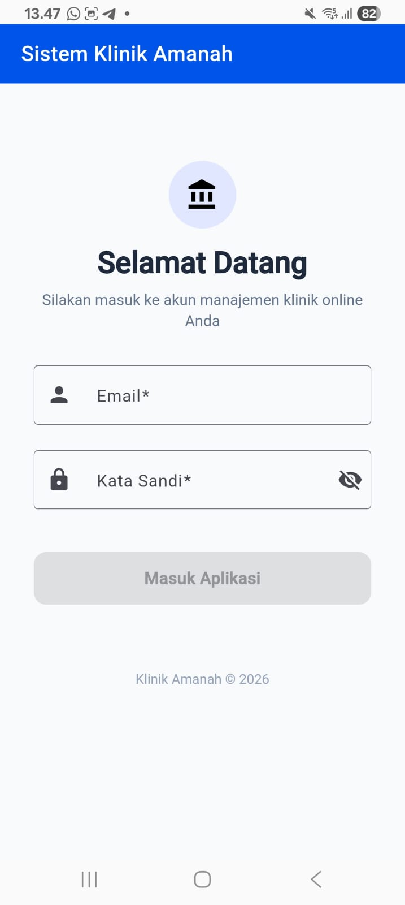<br/>Login</td>
    <td align="center">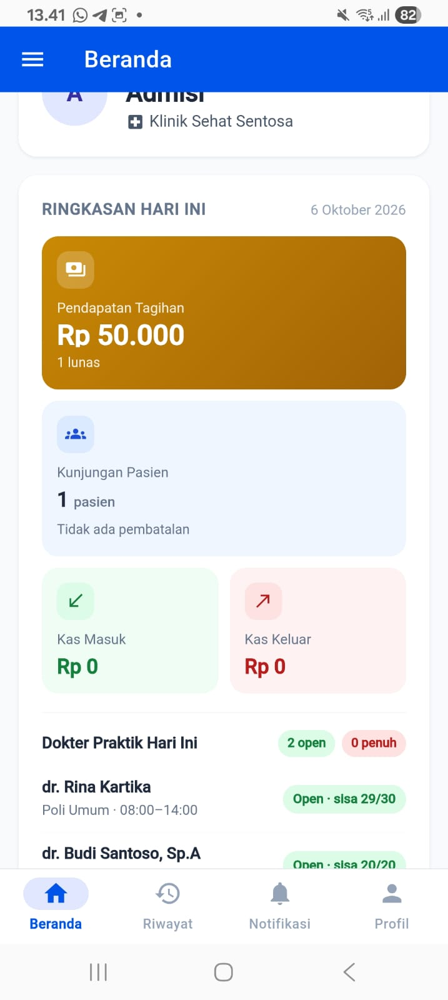<br/>Beranda</td>
    <td align="center">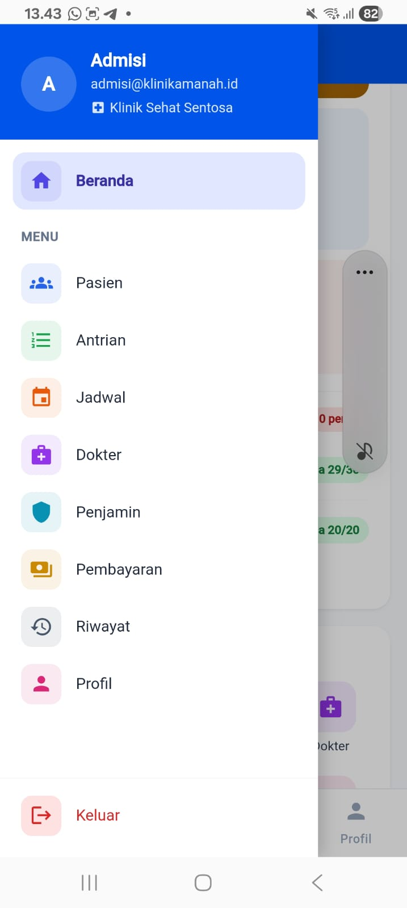<br/>Drawer Menu</td>
    <td align="center">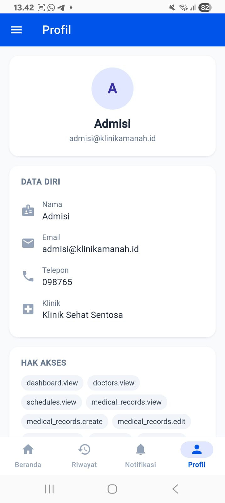<br/>Profil</td>
  </tr>
</table>

### Pasien & Kunjungan

<table>
  <tr>
    <td align="center">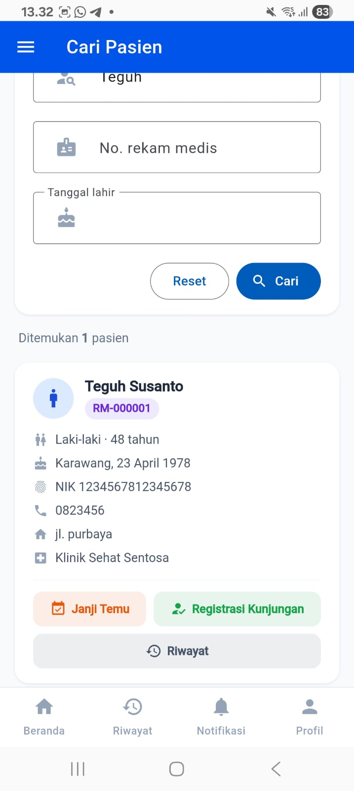<br/>Cari Pasien</td>
    <td align="center">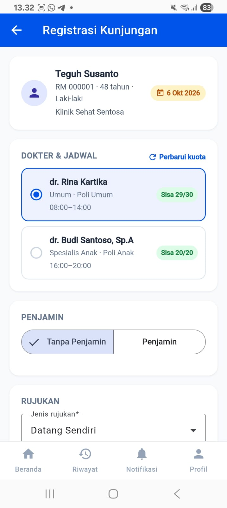<br/>Registrasi Kunjungan</td>
    <td align="center">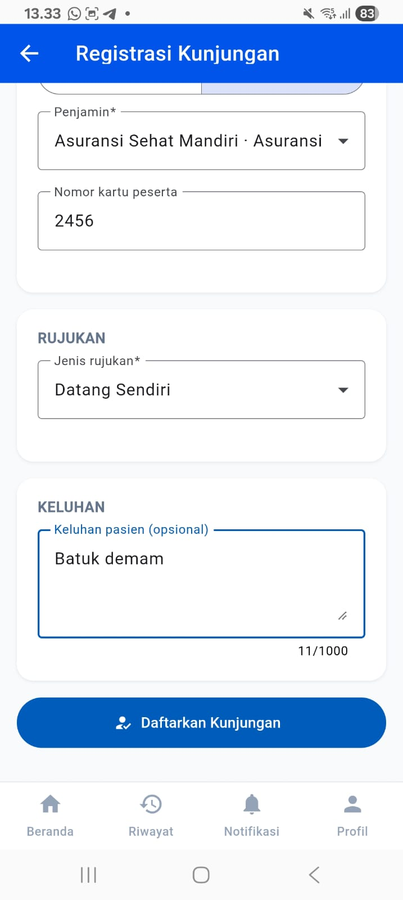<br/>Registrasi: Penjamin & Keluhan</td>
  </tr>
  <tr>
    <td align="center">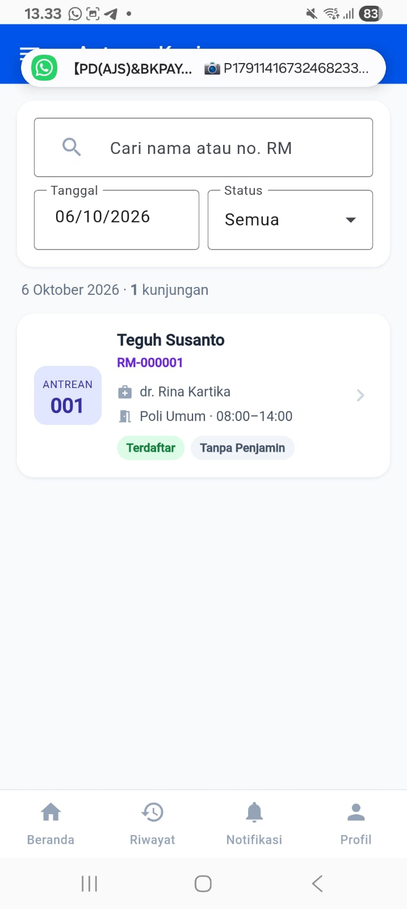<br/>Antrean Kunjungan</td>
    <td align="center">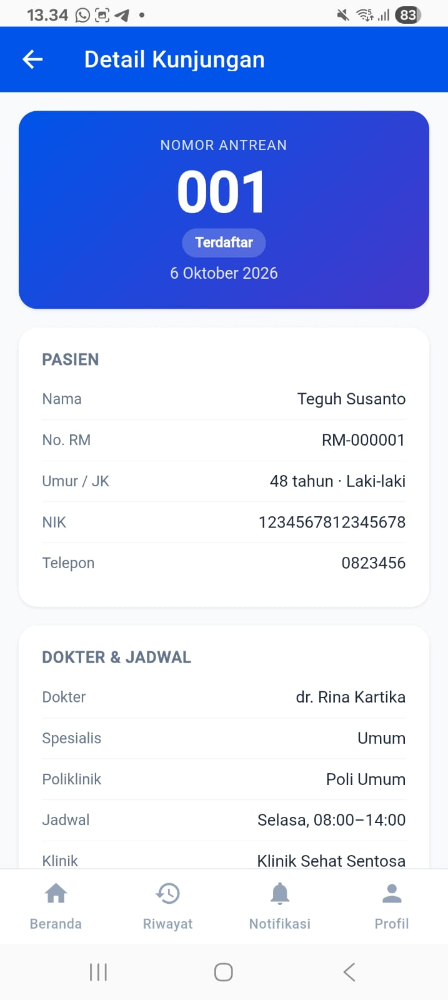<br/>Detail Kunjungan</td>
    <td align="center">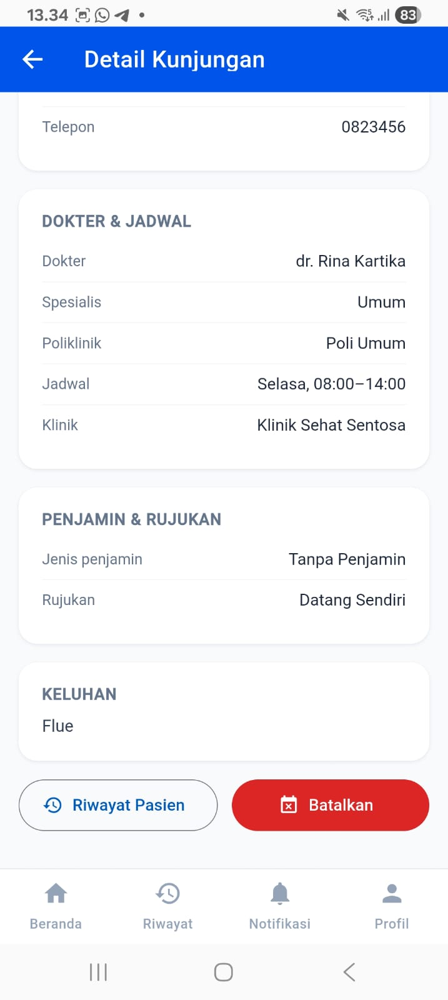<br/>Detail: Dokter & Penjamin</td>
  </tr>
</table>

### Dokter, Jadwal & Penjamin

<table>
  <tr>
    <td align="center">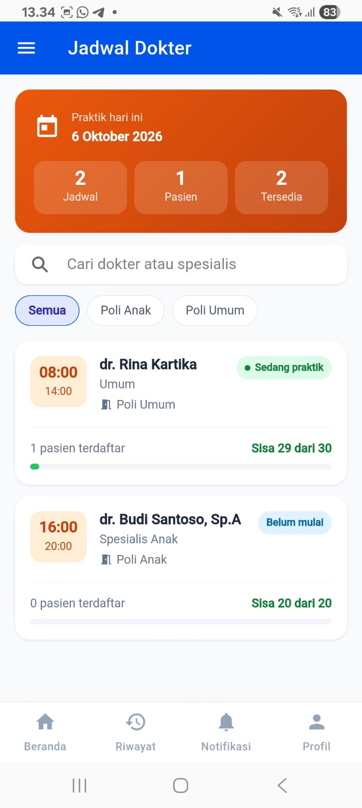<br/>Jadwal Dokter Hari Ini</td>
    <td align="center">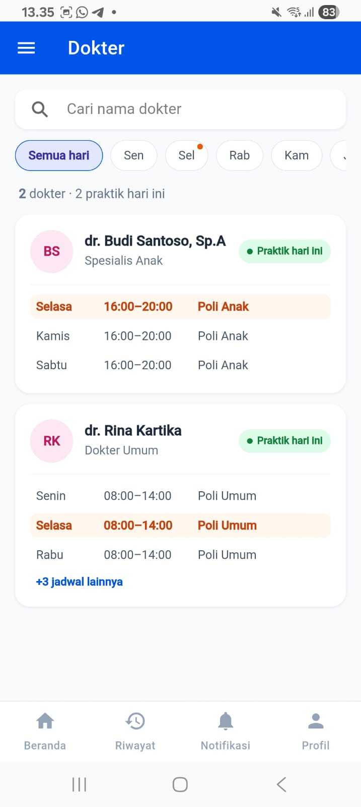<br/>Daftar Dokter</td>
    <td align="center">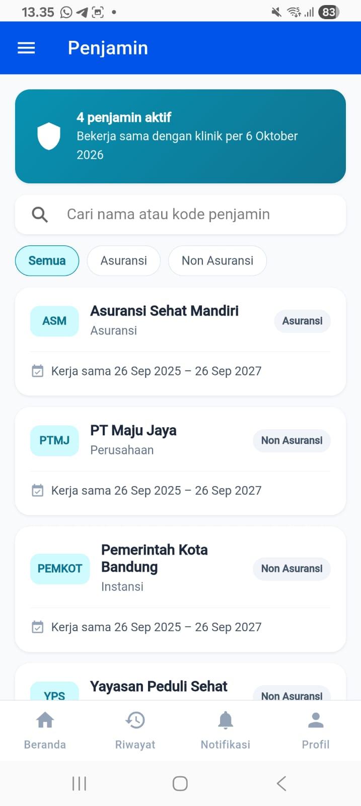<br/>Daftar Penjamin</td>
  </tr>
</table>

### Tagihan & Pembayaran

<table>
  <tr>
    <td align="center">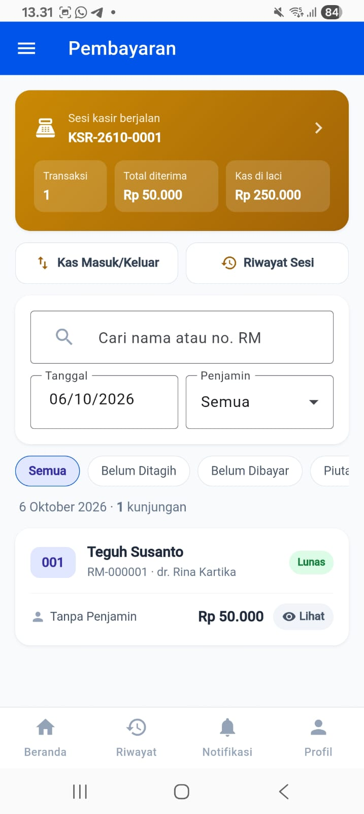<br/>Daftar Tagihan</td>
    <td align="center">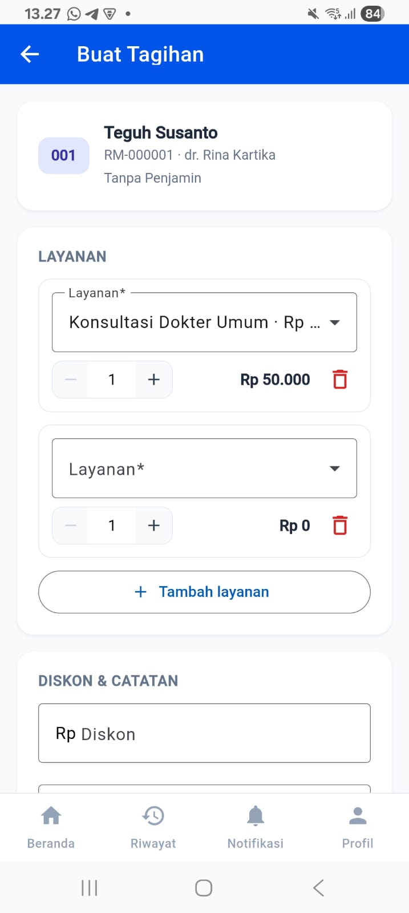<br/>Buat Tagihan</td>
    <td align="center">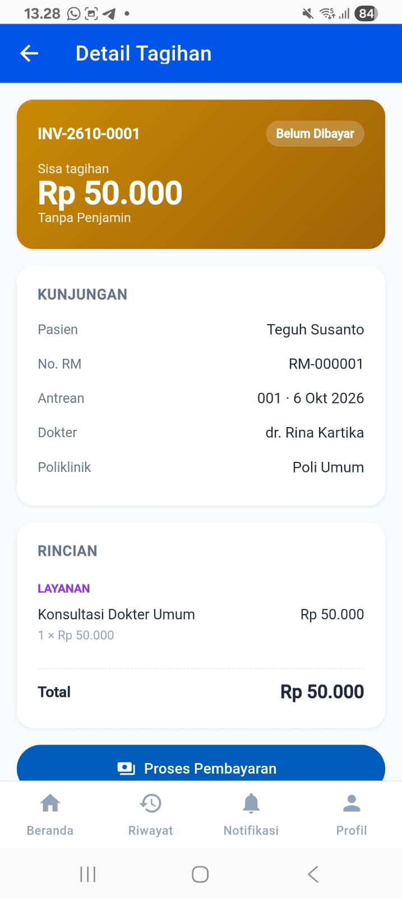<br/>Detail Tagihan</td>
  </tr>
  <tr>
    <td align="center">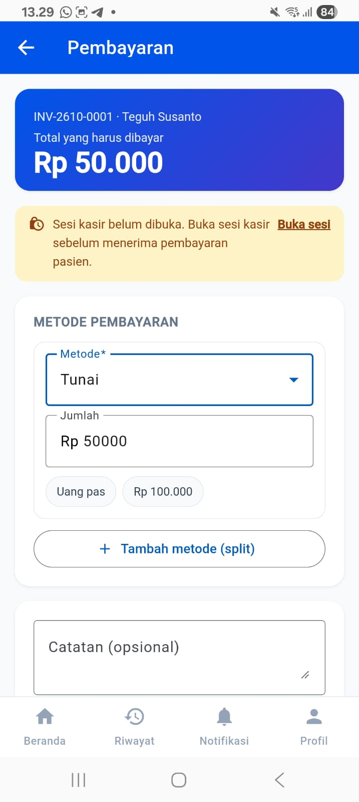<br/>Form Pembayaran</td>
    <td align="center">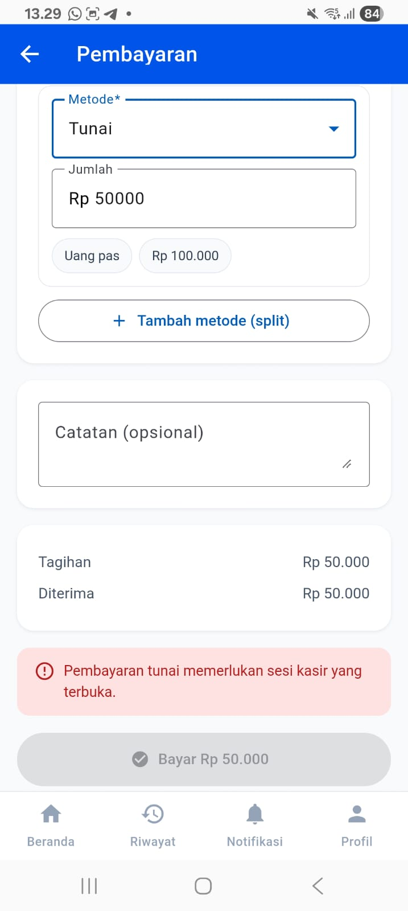<br/>Validasi Sesi Kasir</td>
    <td align="center">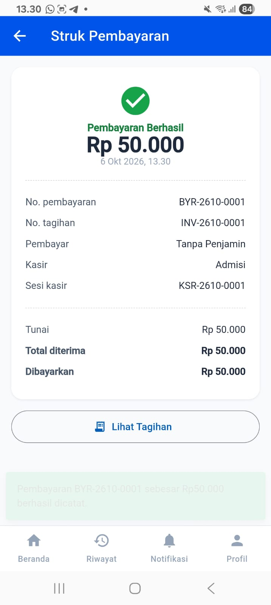<br/>Struk Pembayaran</td>
  </tr>
</table>
